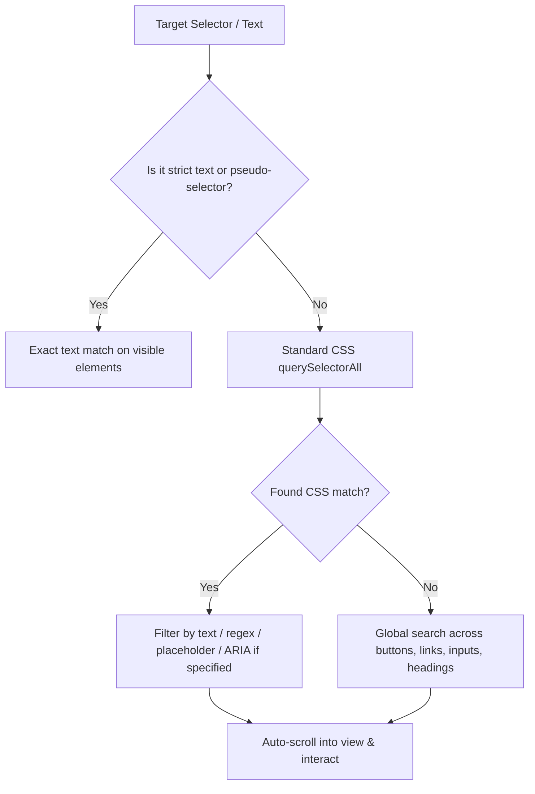

# 🎯 Human-Centric Text & Selector Engine

Dynamic CSS classes (like `css-175oi2r` or `btn_x8z9_2`) break constantly when websites deploy UI updates. **Bflow** is built around **Human-Centric Text Locators**, prioritizing how users and accessibility trees perceive elements.

---

## 🔍 How the Element Finder Works

When you supply a selector, the locator engine checks multiple candidates in order of resilience:



---

## 📝 Supported Selector Syntaxes

### 1. Quoted Text Selectors (`text="..."`)
Matches elements containing or matching the visible string:

```bash
text="Sign In"
text="Add to Cart"
```

### 2. Case-Insensitive Flag (`text/i="..."`)
Matches regardless of uppercase or lowercase:

```bash
text/i="sign in"
text/i="continue with google"
```

### 3. Strict Text Pseudo-Selector (`:text-is("...")`)
Matches exact text equality with optional case flag:

```bash
button:text-is("Submit")
a:text-is("read more", "i")
```

### 4. Starts-With & Ends-With Pseudo-Selectors
```bash
button:starts-with("Download")
span:ends-with("items remaining", "i")
```

### 5. Regex Text Matching (`text=/.../flags`)
```bash
text=/^Order #[0-9]{5}$/i
text=/\$[0-9]+\.[0-9]{2}/
```

---

## 🧩 Accessibility & Form Field Discovery

When targeting form inputs, textareas, and select elements, the engine searches multiple fallback attributes:

1. **Associated `<label>` Text**: Finds `<label for="id">Email Address</label>` and returns the corresponding `<input id="id">`.
2. **Placeholder Text**: Matches `<input placeholder="Enter your email">`.
3. **`aria-label`**: Matches `<input aria-label="Search documentation">`.
4. **`title` attribute**: Matches `<button title="Refresh Feed">`.
5. **Element `value`**: Matches current button or input values.

---

## 📜 Whitespace Normalization

Irregular whitespace, multiple space characters, newlines, and non-breaking spaces (`&nbsp;`) are automatically normalized:

```html
<!-- HTML on page -->
<button>
  Sign
  In
</button>
```

```javascript
// Matches seamlessly:
{ "action": "click", "text": "Sign In" }
```

---

## 🖱️ Automatic Scroll into View

Before executing click or typing interactions, the CDP page client automatically computes element bounding boxes and triggers `scrollIntoViewIfNeeded()`, guaranteeing reliable interactions even on tall or lazy-loaded pages.
