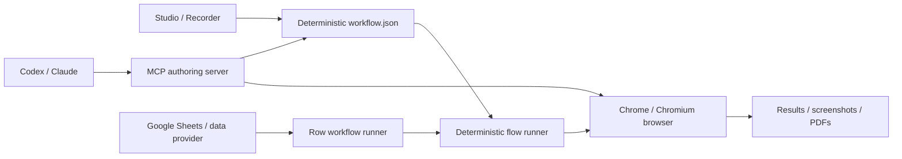

# ⚡ Introduction to Bflow

**Bflow** is an ultra-lightweight, zero-bloat browser automation suite and visual recording studio built on top of the **Chrome DevTools Protocol (CDP)** and the blazing-fast **Bun** runtime.

Traditional browser automation tools (like Puppeteer, Playwright, or Selenium) often require heavy dependencies, thousands of lines of boilerplate code, and fragile CSS/XPath selectors that break with minor front-end layout changes.

Bflow takes a **human-first, declarative approach**:

- **No heavy browser drivers**: Communicates directly with your local Google Chrome/Chromium over native WebSockets using CDP.
- **Standalone zero-dependency binary**: Install via a one-line curl/powershell script and run `bflow` on macOS, Linux, and Windows without Node.js or Bun.
- **Visual recording with In-Page HUD**: An interactive floating toolbar injected directly into Chrome records user actions, assertions, virtual camera feeds, and data extractions.
- **Human-centric text locators**: Locates elements by their human-visible text (e.g., `text="Submit"`), placeholder, or ARIA label rather than fragile dynamic CSS classes.
- **Declarative JSON workflows**: Workflows are stored as readable JSON files that can be edited, version-controlled, and replayed in CI/CD pipelines.
- **Interactive Terminal Wizard**: Launch `bflow` (or `bun cli`) to access a guided terminal menu without remembering flags.
- **Agent-assisted authoring via MCP**: Expose bounded observe/perform/verify/publish tools over MCP stdio to AI agents (Claude Code, Codex), then replay the generated flow without an AI model or API keys.
- **External row execution & Google Sheets**: Stream rows into isolated browser runs with filtering, transformations, retries, resume, and result write-back.
- **Sensitive-data controls**: Keep secrets in environment variables (`{{env.NAME}}`) and redact sensitive row values from logs, summaries, screenshots, and PDFs.

---

## 🎯 Core Capabilities

| Feature | Description |
| :--- | :--- |
| **Interactive Studio** | A guided terminal menu (the *easy way*) with arrow keys to run, record, test, or inspect automations. |
| **Live Visual Recorder** | In-browser floating HUD for point-and-click recording of flows, data extractions, and assertions. |
| **Declarative JSON Replay** | Replay saved workflows in headless or headed mode with dynamic variable overrides. |
| **Agent-Assisted Authoring** | Let Codex, Claude, or another MCP host build a verified workflow that runs later without the agent. |
| **External Data Execution** | Execute once per provider row with bounded workers, checkpoints, and sparse write-back. |
| **Standalone Releases** | Run versioned, checksum-verified macOS, Linux, and Windows executables without a separate Bun installation. |
| **Smart List & Grid Extraction** | Click a single card/table row to automatically extract structured data from repeating elements. |
| **Interactive Browser REPL** | Direct command prompt to navigate pages, inspect elements, evaluate JavaScript, and capture screenshots. |
| **Pre-built Automation Tasks** | Out-of-the-box tasks for web scraping, form filling, and lighthouse-style site auditing. |

---

## 🏗 Architecture

Bflow connects directly to Chrome DevTools Protocol without intermediary webdriver servers:

---

## 🚀 Next Steps

- Check out the [Quick Start Guide](/getting-started/quick-start/) to run your first workflow in 2 minutes.
- Learn about the [Interactive Terminal Studio](/guides/interactive-studio/) — the easiest way to interact with the CLI.
- Use [Agent-Assisted Authoring](/guides/agent-authoring/) or configure an [External Data source](/data/overview/).
