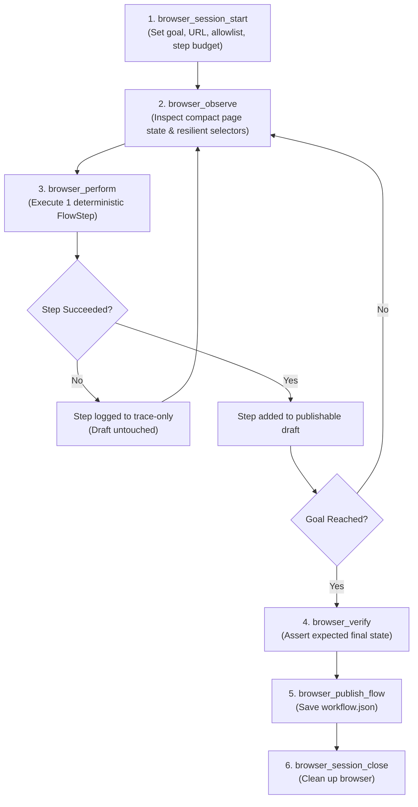

# 🤖 Agent-Assisted Workflow Authoring

The local **Model Context Protocol (MCP)** server lets AI coding agents (such as Claude Code, Codex, or custom MCP clients) operate a persistent, bounded browser session. The agent interacts with the live page, recovers from failures using structured observations, verifies expected outcomes with assertions, and publishes the successful sequence as an ordinary deterministic JSON workflow.

The published workflow runs through the standard Bflow runner — it does not require an AI model, API keys, or an active MCP connection.

```text
Natural Language Goal → Agent + MCP Tools → Observe / Perform / Verify → workflow.json → bflow flow
```

---

## 🔌 Start the MCP Server

The server communicates via **STDIO**, allowing MCP hosts to manage its lifecycle automatically.

### Standalone CLI Installation

```bash
bflow mcp
```

### Monorepo Source Development

```bash
bun mcp
```

---

## ⚙️ Host Configuration Examples

### Claude Code

**Using Standalone Binary:**
```bash
claude mcp add bflow -- bflow mcp
```

**Using Monorepo Source:**
```bash
claude mcp add bflow --scope project -- \
  bun --cwd /absolute/path/to/browser-automation-cli run mcp
```

### Codex

**Using Standalone Binary:**
```bash
codex mcp add bflow -- bflow mcp
```

**Using Monorepo Source:**
```bash
codex mcp add bflow -- \
  bun --cwd /absolute/path/to/browser-automation-cli run mcp
```

> [!TIP]
> Companion instructions for agents are located in [`skills/browser-flow-author/SKILL.md`](file:///Users/bixbd/.gemini/antigravity/worktrees/browser-automation-cli/sync_docs_feature_parity/skills/browser-flow-author/SKILL.md). Install or reference that skill in your agent environment for optimal autonomous performance.

---

## 🛠️ Complete MCP Tools Reference

The server exposes 8 specialized authoring tools:

| Tool | Parameters | Description |
| :--- | :--- | :--- |
| `browser_profiles_list` | *(None)* | Lists available local browser profiles (Chrome, Brave, Edge) with safe IDs and display names. File paths and account tokens are omitted. |
| `browser_session_start` | `goal` (string), `initialUrl` (URL), `headed` (bool, default `true`), `allowedDomains` (string[], max 20), `maxSteps` (int 1–200, default `50`), `timeoutMs` (int 1,000–3,600,000, default `900,000`), `profile` (string), `profileAccessConfirmed` (bool, default `false`) | Launches a bounded, persistent browser session. Returns `sessionId`, `allowedDomains`, `tracePath`, and the initial page observation. |
| `browser_observe` | `sessionId` (UUID) | Inspects the current page state, returning URL, title, visible text snippets, active frames, and up to 120 interactive elements with resilient selectors. Call before choosing actions and after any failure. |
| `browser_perform` | `sessionId` (UUID), `step` (FlowStep object), `variables` (record), `confirmed` (bool, default `false`) | Executes one deterministic workflow step. Successful steps enter the publishable draft; failed steps remain trace-only. |
| `browser_verify` | `sessionId` (UUID), `assertion` (AssertStep object) | Tests a postcondition assertion on the page. At least one successful verification is mandatory before publication. |
| `browser_publish_flow` | `sessionId` (UUID), `path` (string), `name` (string), `description` (string), `variables` (record) | Validates and writes the successful step sequence into a standalone JSON workflow file. |
| `browser_trace_get` | `sessionId` (UUID) | Retrieves the structured action/observation audit log. Redacts sensitive inputs and excludes internal model reasoning. |
| `browser_session_close` | `sessionId` (UUID) | Closes Chrome and releases session resources from memory. |

---

## 🔄 Authoring Lifecycle



1. **Start a bounded session**: Provide the user's goal, initial URL, and optional domain allowlist (`allowedDomains`).
2. **Observe before acting**: Read compact visible text, frames, and resilient selectors instead of huge raw DOM trees.
3. **Execute one step at a time**: Call `browser_perform` with a valid `FlowStep`. Successful steps enter the workflow draft; failed attempts are recorded in `trace.jsonl` for diagnosis without corrupting the draft.
4. **Recover dynamically**: If a step fails, call `browser_observe` to inspect current layout changes and pick a more resilient locator.
5. **Verify final state**: Call `browser_verify` with an `assert` step to confirm the page reached its target state (e.g. "Order Confirmed").
6. **Publish and close**: Call `browser_publish_flow` to write `workflows/<name>.json`, then call `browser_session_close`.

---

## 🛡️ Safety Boundaries & Guardrails

The authoring environment enforces strict security and resource policies:

- **Domain Whitelisting**: Sessions are restricted to the initial website's domain by default. Additional domains (up to 20) must be explicitly declared in `allowedDomains`. Navigation to unlisted domains is blocked.
- **Bounded Step Budget**: Limits total attempted actions to between 1 and 200 (default: 50). Exceeding the budget halts execution to prevent infinite loops.
- **Session Timeout**: Enforces hard timeouts between 1 second and 60 minutes (default: 15 minutes / 900,000ms).
- **Profile Confirmation**: Browser profiles are never opened directly without `profileAccessConfirmed: true`. Selected profiles are cloned into temporary sandboxes.
- **Sensitive Action Confirmations**: High-impact actions (clicks matching `delete`, `remove`, `purchase`, `buy`, `pay`, `place order`, `submit`, `send`, `publish`, `confirm`, `book`, `transfer`, `approve`) or arbitrary `eval` steps require explicit confirmation (`confirmed: true`) after user approval.
- **Zero Secrets in Tool Arguments**: Passwords, API tokens, and credentials must be referenced via environment placeholders (`{{env.ACCOUNT_PASSWORD}}`). The authoring server rejects literal secrets.
- **Mandatory Final Verification**: Workflows cannot be published without at least one passing `browser_verify` assertion.
- **Redacted Trace Logs**: Traces written to `output/authoring/<session-id>/trace.jsonl` redact typed strings and evaluation payloads.

---

## 🌊 Replaying Without the Agent

Once the workflow JSON is published, you can replay it anytime without AI models or MCP:

```bash
# Standalone CLI
bflow flow workflows/my-workflow.json

# Monorepo development
bun flow workflows/my-workflow.json
```

Pass runtime variable overrides or environment values as needed:

```bash
ACCOUNT_PASSWORD="my-secure-password" bflow flow workflows/my-workflow.json --headed
```

